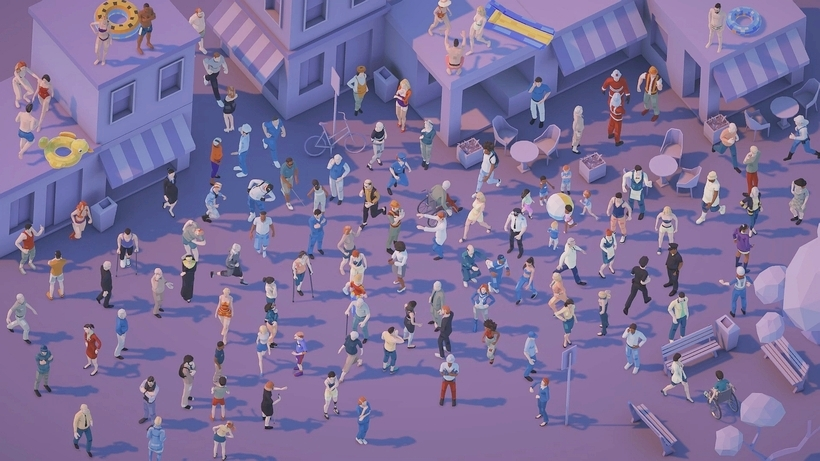
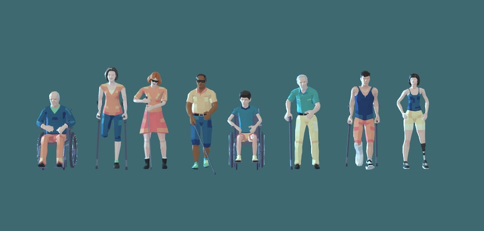
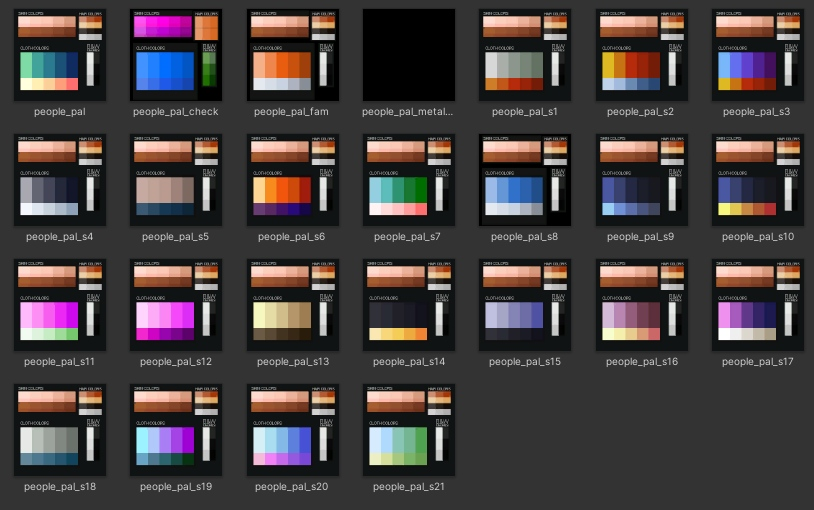

# City People Mega-Pack

Welcome to the **City People Mega-Pack**! This package provides a diverse collection of city characters to bring life to your Unity projects. Below you'll find all the information you need to get started, including details on new updates, demo scenes, and how to integrate the assets into your project.

## Table of Contents

1. [Introduction](#introduction)
2. [What's New in v1.3.0](#whats-new-in-v130)
3. [Getting Started](#getting-started)
4. [Demo Scenes](#demo-scenes)
   - [Demo Scene 1: Character Showcase](#demo-scene-1-character-showcase)
   - [Demo Scene 2: Isometric City](#demo-scene-2-isometric-city)
5. [Character Groups](#character-groups)
6. [Animations](#animations)
7. [CityPeople Component Script](#citypeople-component-script)
8. [Palette System and UV](#palette-system-and-uv)
9. [URP Support](#urp-support)
10. [Unity 6 Compatibility](#unity-6-compatibility)
11. [Support](#support)

---

## Introduction

The **City People Mega-Pack** is designed to populate your urban environments with a rich variety of animated characters. Whether you're building a bustling cityscape, a serene town, or an interactive simulation, this pack offers the assets you need to create a dynamic and inclusive world. The Polyart style provides optimized characters, making them suitable for low-end devices and AR/VR simulations.

## What's New in v1.3.0

- **Enhanced Demo\_1\_Showcase Scene**: Hovering over characters now increases their size (focus effect), and clicking cycles through available material palettes.
- **New Demo Scene**: Introduced **Demo\_2\_IsoCity**, an isometric view of a town populated with animated characters. A few simple buildings have been added to enhance the package with this scene.

- **Inclusive Characters**: Added 8 new characters representing people with disabilities, each featuring 3 unique, tailored animations.
- **CityPeople Script Update**: New method for easy material switching that intelligently replaces materials with the "people\_pal" prefix.
- **URP Support**: Added Universal Render Pipeline (URP) compatibility with a package that replaces standard materials.
- **Unity 6 Compatibility**: Fully tested and compatible with Unity 6.

## Getting Started

1. **Import the Package**: Download and import the **City People Mega-Pack** into your Unity project.
2. **URP Setup (Optional)**: If you're using URP, navigate to the `URP` folder and install the provided package to update materials by double-clicking the Material\_URP unity package.
3. **Explore Demo Scenes**: Open the demo scenes to see the characters in action!

## Demo Scenes

### Demo Scene 1: Character Showcase

- **File**: `Demo_1_Showcase.unity`
- **Description**: An interactive scene where you can view all characters. Hover over them to see the focus effect, and click to cycle through different material palettes. Use arrow keys or screen buttons to navigate between character groups.

### Demo Scene 2: Isometric City

- **File**: `Demo_2_IsoCity.unity`
- **Description**: A beautifully crafted isometric town scene showcasing all animated characters from a top-down orthographic perspective.

## Character Groups | [WATCH VIDEO!](https://youtu.be/dUjK32yOMVo)
- (8) **People with disabilities:** Individuals using wheelchairs, crutches, prostetics, etc. **(NEW!)**
- (10) **Young adults:** Representing ages from 18 to 30.&#x20;
- (20) **City:** Everyday city people in casual and business outfits.
- (20) **Professionals:** Representing common professions.
- (20) **Downtown:** Similar to 'City', but a little bit more fresh and modern.
- (6) **Kids:** Young boys and girls about 10 to 15 years old.​
- (10) **Elders:** Older individuals aged about 60-70 years old.
- (10) **Beach:** A set of characters from 'Downtown' but dressed in swimsuits.
- (6) **Little Kids:** Younger kids from 3 to 5 years old.
- (8) **Xtras:** A miscellaneous group representing additional professions.&#x20;

## Animations

- **Standard Characters**: A set of common animations suitable to most characters.
  - Walking (6)
  - Running (4)
  - Idle (6)
  - Dancing (5)
  - Warming Up

- **Characters with disabilities**:
  - Each has 3 tailored animations specific to their design and mobility aids: Idle, forward and talk.

## CityPeople Component Script

Located in the `Scripts` folder, the **CityPeople** component script offers basic functionality to control character behaviors and appearances. 

### Key Features

- **Material Switching Method**: Easily change a character's material palette using the new method: `public void SetPalette(Material mat)`
  - **Usage**: This method replaces materials with the `people_pal` prefix while leaving other materials untouched.
- **Auto Play Animation:** Setting this field to `True` in the inspector makes the character switch animations randomly for testing and demonstration purposes. 

## Palette System and UV

The characters UV have been mapped in a way to make easy the switching of palettes. These textures (acting as palettes) have a standardized structure with areas corresponding to different surfaces of the characters:

- Skin colors
- Hair colors
- Clothes colors
- Dark and Light details.

A single texture/material pair can be applied to all the characters in this package. And any texture/material can be applied to any character.

Free tool [DA Poly Paint](https://assetstore.unity.com/packages/tools/painting/da-polypaint-low-poly-customizer-251157) can be used to further modify the UV 'painting' by model with ease.

## URP Support

To ensure compatibility with projects using the Universal Render Pipeline:

1. **URP active:** Ensure Universal Renderer Pipeline is configured first.
2. **Navigate**: Go to the `URP` folder in the package.
3. **Install**: Import the`Mateials_URP (DoubleClickMe).unitypackage`.
4. **Update Materials**: This will replace all standard materials with URP-ready alternatives.

## Unity 6 Compatibility

The **City People Mega-Pack** has been thoroughly tested with Unity 6 to guarantee seamless integration:

- **Performance**: Optimized for the latest Unity engine enhancements.
- **Features**: Fully compatible with new Unity 6 features and improvements.

## Support

If you have any questions or need assistance:

- **Email**: [denys.almaral@gmail.com](mailto\:denys.almaral@gmail.com)
- **Website**: [DenysAlmaral.com](https://denysalmaral.com)
- **Forum**: [Github Discussions](https://github.com/piXelicidio/Chat/discussions/2)

---

Thank you for choosing the **City People Mega-Pack**. We hope these assets help you create engaging and diverse urban environments in your Unity projects!
